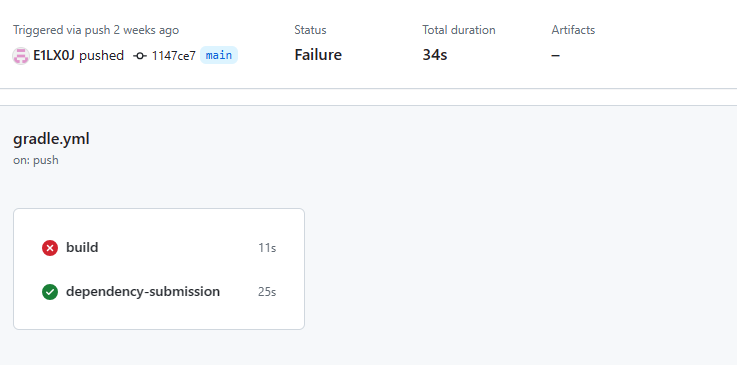

### DOKUMENTÁCIÓ - *Madagaszkár Pingvinjei*

#

#

### *Technológia 1*
# Build keretrendszer és CI beüzemelése
## Célkitűzés:
*GitHub Actions és Gradle beüzemelése.*

## Leírás
#### Gradle
A Gradle-lel a szoftverfejlesztést bizonyos szinten automatizálni tudjuk, ezzel gyorsítva és biztosabbá téve kódunkat.

#### GitHub Actions
GitHub Actions használatával tudtuk automatizálni folyamatos integrációt, a munkafolyamatok létrehozását közvetlenül a repository-n belül annak minőségének növelésére.

## Munkafolyamat
Első mérföldként a Gradle beüzemelése mellett döntöttünk, amit sikerült gyorsan implementálnunk.

A 'build.gradle' file-ban definiáltuk a függőségek, plug-in-ek és konfigurációk listáját, amikkel a projekt működését, sajátosságait írjuk körül.

A 'gradlew' file szintén külön kiemelést érdemel. Ez a Gradle Wrapper végrehajtható file-ja, amivel tudjuk futtatni a Gradle-t anélkül hogy telepíteni kéne akármiénk gépére, ezzel gyorsítva a feladatok megoldását.

A Gradle tesztelés egyik kimenetét megtekinthetjük az alábbi ábrán.

A Gradle megfelelő használatához *@E1LX0J* készített egy útmutatót, amivel el lehetett indítani az alkalmazást a Gradle segítségével.
Ennek legfontosabb részlete volt a megfelelő JDK verzió (*17*) beállítása a környezeti változókon belül, így már a rendszer felismerte a JDK-t és automatikusan használhatta az alkalamzás futtatására.

Ennek a folyamatnak a képekkel ellátott dokumentációját megtalálható a repository-n belül.

A csapat tagjainak review-jai után implementálva is lett a Gradle a projektünkbe, így már akármiénk clone-ozhatott a fő branch-ből és a számára kiosztott tesztelési és integrációs feladatokat könnyedén megoldhatta a Gradle segítségével összetett konfigurációk és telepítés nélkül.

A második lépés a CI (*CI = Continuous Integration*) beüzemelése volt. Itt egyszerűen csak hozzáadtuk a GitHub Actions-höz a "*Java CI with Gradle*"-t, amivel egyszerűen automatizálhattuk a kód tesztelését, építését és telepítését is.

Itt talán a legfontosabb említésre méltó file a '*Workflow*' file, ami magát a CI-t kezeli. Itt definiáltuk az integráció végrehajtandó feladatait, eseményeit.

Ez a file a következő fejezetekben is kitüntetett fontossággal szerepel, mivel a további CI/CD szint emelés érdekében használt szoftvereknek a működését is itt definiálhatjuk.

Ezekkel a lépésekkel felhúztunk az alkalmazás tesztelésére, kezelésére egy közös vázt, amit bárki bármikor egyszerűen elérhet.
