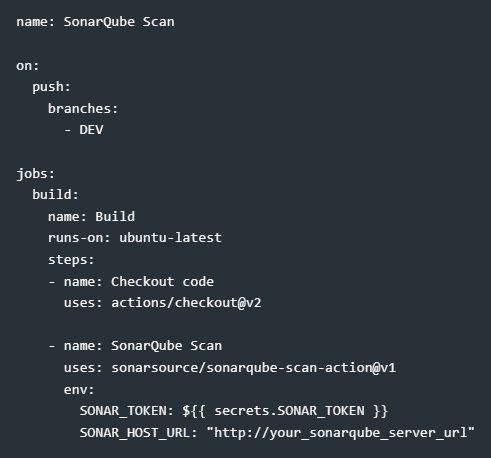
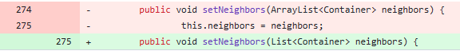
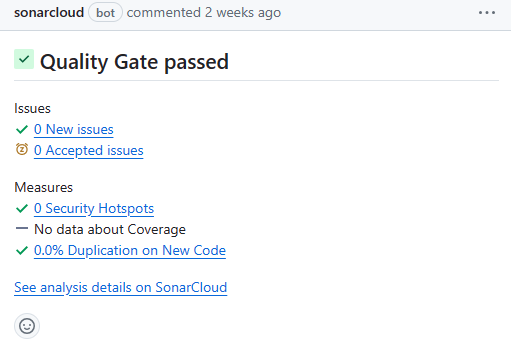

### DOKUMENT�CI� - *Madagaszk�r Pingvinjei*

#

#

### *Technol�gia 2*
# SonarQube be�zemel�se
## C�lkit�z�s
*Statikus hibaanal�zis �rdek�ben SonarQube be�zemel�se, futtat�sa.*

## Le�r�s
#### SonarQube
A SonarQube f� c�lja a letisztult, optim�lis "Clean Code", amit a k�dunk automatikus fel�lvizsg�lat�val �r el, �s amivel t�mogatni tudja a CI/CD megval�s�t�s�t. Ezt k�l�nb�z� tesztel�sekkel �ri el. Az �ltala aj�nlott v�ltoztat�sok ak�r a projekt architekt�r�j�ra is kihat�ssal lehetnek.

## Munkafolyamat
Ez a szoftver volt csapatunk sz�m�ra ez egyik leghasznosabb technol�gia, amit a repository "Issue" logj�nak megtekint�s�vel egy�rtelm�en �szre lehet venni.

Rengeteg hib�t �s aj�nl�st jelzett nek�nk a projektben, amik egyszer� �t�r�sokt�l ak�r az oszt�lyok strukt�r�j�nak polimorfizmussal t�rt�n� �t�p�t�s�t is magukkal vonhatt�k.

Az els� l�p�s a szoftver hozz�ad�sa volt a repository-hoz. Ezt a let�lt�se ut�n egy �j Git-es "*secret*" l�trehoz�s�val tudtuk hozz�adni a repository-hoz, majd pedig a l�trej�tt konfigur�ci�s file-ban a kulcs be�ll�t�s�val v�gleges�teni.

Ezek ut�n kor�bban eml�tett Workflow file-unkban tudtuk a SonarQube m�k�d�s�t defini�lni.�

Al�bb megtekinthet� a SonarQube implement�ci�s Workflow file-ra egy p�lda.

A SonarQube �sszesen 8 k�l�nb�z� oszt�lyban tal�lt elt�r� s�lyoss�g� hib�t, amik jav�t�s�val sokkal �rtelmesebb, �tl�that�bb �s kezelhet�bb lett az alkalmaz�s oszt�ly-, �s f�ggv�nyk�szlete, illetve maga a szoftverarchitekt�ra is.

Ezekb�l a jav�t�sokb�l szeml�ltet�sk�pp itt felsorolunk h�rmat:

*1: Kasztol�s elker�l�se megfelel� f�ggv�nyek megh�v�s�val*

*2: L�that�s�g korl�toz�sa a biztons�g �rdek�ben*

*2: K�doptimaliz�l�s megfelel� lista strukt�ra haszn�lat�val*

A SonarQube-os integr�ci� v�gs� kimenet�t megtekinthetj�k az al�bbi k�pen.

