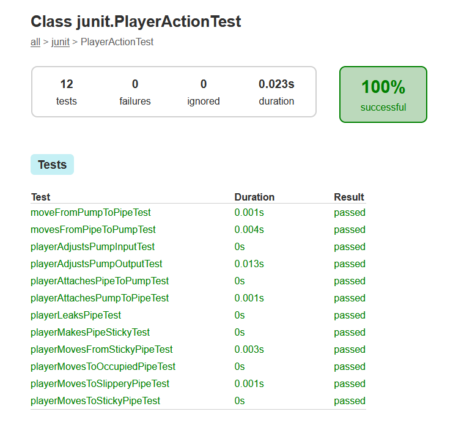
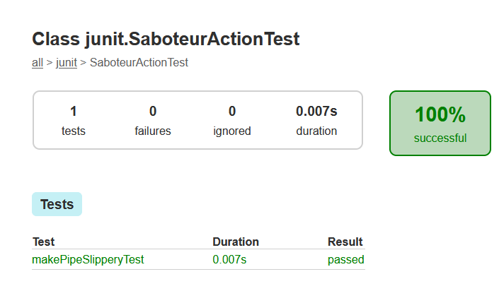
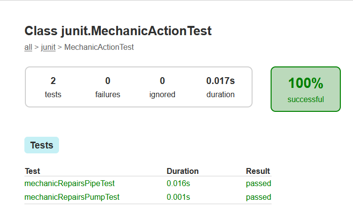
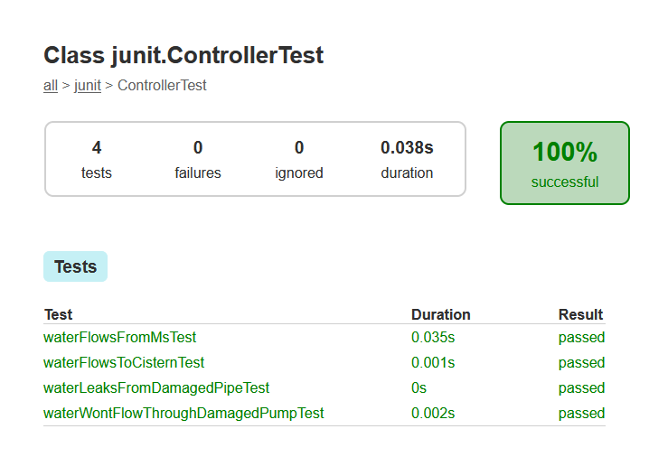
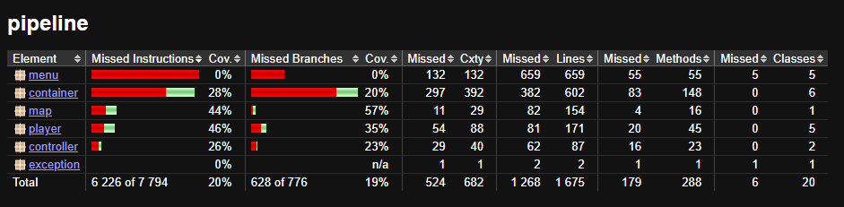

### DOKUMENTÁCIÓ - *Madagaszkár Pingvinjei*

#

#

# JUnit tesztek írása
## Célkitűzés
Manuális tesztelés végrehajtása JUnit teszteléssel

## Leírás
#### JUnit
A JUnit egy tesztautomatizálási keretrendszer a Javához. Lehetővé teszi az egységtesztelést, mely által ellenőrizni tudjuk a program helyes működését.

## Munkafolyamat
A JUnit tesztelési folyamat során először a megfelelő környezetet kell beállítani, majd a teszteseteket kell megírni és futtatni. A tesztek írása folyamán különböző teszteseteket definiáltunk a projekt különböző funkcióinak tesztelésére. A tesztek célja, hogy lefedjék a projekt különböző funkcióit és biztosítsák, hogy a kód helyesen működik. A tesztesetek bemenetei és kimenetei előre meghatározottak, és a JUnit keretrendszer segítségével automatikusan ellenőrizhetők.

## Tesztterv
### ControllerTest.java
#### Tesztek leírása:
1. Water flows from Mountain Spring
- Leírás: Azt ellenőrzi, hogy a víz folyik-e a hegyi forrásból.
- Bemenet: Inicializált térkép hegyi forrással.
- Kimenet: A hegyi forrás vízszintje változik.

2. Water flows into Cistern
- Leírás: Azt ellenőrzi, hogy a víz beáramlik-e a ciszternába.
- Bemenet: Inicializált térkép ciszternával.
- Kimenet: A ciszterna vízszintje változik 10 kör után.

3. Water leaks from damaged pipe
- Leírás: Azt ellenőrzi, hogy a víz szivárog-e a sérült csőből.
- Bemenet: Inicializált térkép sérült csővel.
- Kimenet: A szivárgó víz mennyisége változik 10 kör után.

4. Water won't flow through damaged pump
- Leírás: Azt ellenőrzi, hogy a víz nem folyik át a sérült szivattyún.
- Bemenet: Inicializált térkép sérült szivattyúval.
- Kimenet: A ciszterna vízszintje nem változik 10 kör után.

### MechanicActionTest.java
#### Tesztek leírása
1. Mechanic repairs pipe
- Leírás: Azt ellenőrzi, hogy a szerelő meg tudja-e javítani a csövet.
- Bemenet: Szerelő és sérült cső.
- Kimenet: A cső nem sérült.

2. Mechanic repairs pump
- Leírás: Azt ellenőrzi, hogy a szerelő meg tudja-e javítani a szivattyút.
- Bemenet: Szerelő és sérült szivattyú.
- Kimenet: A szivattyú nem sérült.

### PlayerActionTest.java
#### Tesztek leírása
1. Player moves from pipe to pump
- Leírás: Azt ellenőrzi, hogy a játékos mozog-e a csőből a szivattyúba.
- Bemenet: Játékos csőben, szomszédos szivattyúval.
- Kimenet: A játékos pozíciója a szivattyúban van.

2. Player moves from pump to pipe
- Leírás: Azt ellenőrzi, hogy a játékos mozog-e a szivattyúból a csőbe.
- Bemenet: Játékos szivattyúban, szomszédos csővel.
- Kimenet: A játékos pozíciója a csőben van.

3. Player leaks pipe
- Leírás: Azt ellenőrzi, hogy a játékos szivárogtatja-e a csövet.
- Bemenet: Játékos csőben.
- Kimenet: A cső sérült.

4. Player moves to sticky pipe
- Leírás: Azt ellenőrzi, hogy a játékos mozog-e a ragadós csőbe és ragadós lesz-e.
- Bemenet: Játékos szomszédos ragadós csővel.
- Kimenet: A játékos ragadós.

5. Player tries to move from sticky pipe
- Leírás: Azt ellenőrzi, hogy a játékos nem tud mozogni a ragadós csőből.
- Bemenet: Játékos ragadós csőben.
- Kimenet: A játékos nem mozdul el.

6. Player tries to move to occupied pipe
- Leírás: Azt ellenőrzi, hogy a játékos nem tud mozogni a foglalt csőbe.
- Bemenet: Játékos szomszédos foglalt csővel.
- Kimenet: A játékos nem mozdul el.

7. Player makes pipe sticky
- Leírás: Azt ellenőrzi, hogy a játékos ragadóssá teszi-e a csövet.
- Bemenet: Játékos csőben.
- Kimenet: A cső ragadós.

8. Player moves to slippery pipe
- Leírás: Azt ellenőrzi, hogy a játékos mozog-e a csúszós csőbe és elcsúszik-e.
- Bemenet: Játékos szomszédos csúszós csővel.
- Kimenet: A játékos nem marad a csúszós csőben, hanem a szomszédos pozíciók egyikében van.

9. Player adjusts pump input
- Leírás: Azt ellenőrzi, hogy a játékos beállítja-e a szivattyú bemenetét.
- Bemenet: Játékos szivattyúban, szomszédos csővel.
- Kimenet: A szivattyú bemenete a szomszédos cső.

10. Player adjusts pump output
- Leírás: Azt ellenőrzi, hogy a játékos beállítja-e a szivattyú kimenetét.
- Bemenet: Játékos szivattyúban, szomszédos csővel.
- Kimenet: A szivattyú kimenete a szomszédos cső.

11. Player attaches pump to pipe
- Leírás: Azt ellenőrzi, hogy a játékos hozzá tudja-e csatolni a szivattyút a csőhöz.
- Bemenet: Játékos csőben, kézben tartott szivattyúval.
- Kimenet: A cső és a szivattyú összekapcsolva.

12. Player attaches pipe to pump
- Leírás: Azt ellenőrzi, hogy a játékos hozzá tudja-e csatolni a csövet a szivattyúhoz.
- Bemenet: Játékos szivattyúban, kézben tartott csővel.
- Kimenet: A szivattyú és a cső összekapcsolva.

### SaboteurActionTest.java
#### Tesztek leírása
1. Saboteur makes pipe slippery
- Leírás: Azt ellenőrzi, hogy a szabotőr csúszóssá teszi-e a csövet.
- Bemenet: Szabotőr csőben.
- Kimenet: A cső csúszós.

## Tesztek futásának eredménye

#

### PlayerActionTest.java osztályban megírt tesztek eredménye

#

### MechanicActionTest.java osztályban megírt tesztek eredménye

#

### SaboteurActionTest.java osztályban megírt tesztek eredménye

#

### ControllerActionTest.java osztályban megírt tesztek eredménye

#

## Teszt kódlefedettsége JaCoCo-val
### A JaCoCo-ról
*A JaCoCo egy nyílt forráskódú Java kódfedettség eszköz, amely lehetővé teszi a tesztek által lefedett kódrészek mérését és jelentését. Ennek segítségével a továbbiakban a szoftver minősége javítható a kódlefedettségi szint növelésével.*
### Képernyőkép a kódlefedettségről
