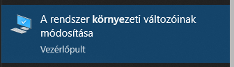
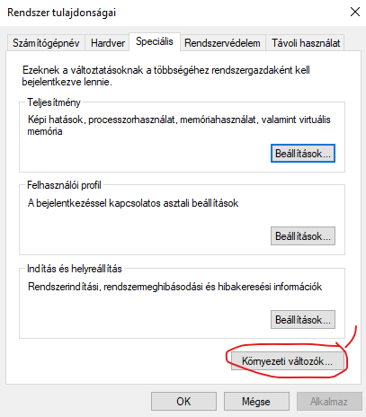
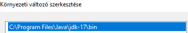

# Alkalmazás beüzemelése

## JDK ellenőrzés (17)
Nézd meg a gépeden feltelepített jdk verziót (cmd-ben java -version command segítségével megtehető)
- ha jdk 8-17 körüli verziód van akkor nincs több teendő
- ha jdk 17 feletti (lehet, hogy csak a 21 felettiekre igaz) akkor tegyél fel egy 17-es verziót
    - letöltöd a jdk-17-et és másold át a mappát valamilyen olyan helyre amihez lehetőleg hozzá tud férni a gép (tehát ne hagyd User alattiba)
    - utána windows-ban (tekintve, hogy nem használok más OS-t ezért azt most ne fogom leírni, hogy ott, hogy kell) search -> "Környezeti változók" (vagy System Variables, hogyha angol)
- utána jobb alsó sarokban "Környezeti Változók" (vagy System Variables) 
- a felső részben JAVA_HOME-ban megadod az elérési útját a letöltött mappának (nem bin-ig) 
- rendszerváltozóknál pedig a Path-re rányomsz -> Szerkesztés -> és átállítod az elérési utat a jdk-hoz arra a mappára amit letöltöttél 

## Program futtatása
 A GitHub repo-ban csak a pipeline nevezetű mappára lesz szükségünk mert az tartalmazza a gradle build alatti programot
- töltsd le majd tedd valamilyen külső mappába a pipeline mappát
- ezt követően nyisd meg a cmd-t és cd-z be ebbe a mappába
- írd be, hogy gradlew run
- várj és elvileg kész is (ha megvan a megfelelő jdk verziód)

## Képek
### System Variables Elérése

### System Variables Beállítása

